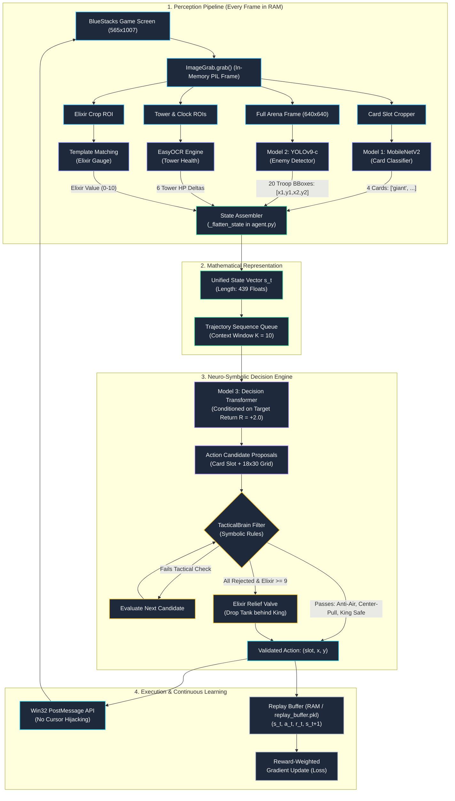
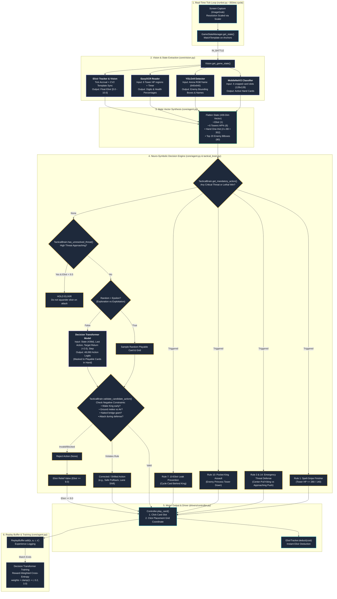

# ⚔️ Royale-RL: Autonomous Tactical Reinforcement Learning Agent

[](https://www.python.org/)
[](https://pytorch.org/)
[](https://microsoft.com/windows)
[](https://developer.nvidia.com/cuda-toolkit)
[](LICENSE)

An advanced, production-grade autonomous agent and training pipeline for **Clash Royale**. **Royale-RL** integrates real-time computer vision, a **Reward-Conditioned Decision Transformer** policy network, a **Deterministic Tactical Counter-AI Rule Engine**, and low-latency Windows API driver controls to achieve autonomous 24/7 self-play, human demonstration recording, and continuous offline reinforcement learning.

---

## 🏛️ System Architecture

### Pipeline Architecture Overview



### End-to-End Decision & Real-Time Tick Loop



---

## ✨ Key Features

- **Hybrid Intelligence Architecture**:
  - **Decision Transformer (Offline RL)**: Sequence modeling architecture predicting high-reward card deployments conditioned on multi-step trajectory history and cumulative return.
  - **Tactical Counter Engine**: High-speed, deterministic tactical rules ensuring optimal plays:
    - *Center-Pull Kiting*: Pulls win conditions (Giant, Hog Rider) toward the center kill-zone (Tile 4-3).
    - *Anti-Air & Ground Validation*: Strictly prevents invalid interactions (e.g. dropping ground melee on flying units).
    - *Lethal Finish Snipes*: Guaranteed instant spell victory snipes on critical Crown Towers.
    - *Dormant King Tower Protection*: Prevents accidental early King Tower activations.
    - *Pocket Exploitation & Breach Pushes*: Automatic spearhead offensive deployments upon destroying lane towers.
    - *Elixir Leak Prevention & Tactical Lock*: Never wastes 10-elixir cap; queues hard-counters against approaching threats.
- **Real-Time Perception Suite**:
  - **YOLOv9**: Identifies and bounds enemy troops, buildings, and champions across both lanes.
  - **MobileNetV2**: Classifies current 4 cards in hand with dynamic elixir state normalization.
  - **EasyOCR + Template Matching**: Live extraction of King/Princess tower health and elixir count.
  - **Dynamic Scaler**: DPI-aware viewport tracking that auto-adapts to emulator repositioning.
- **Windows Native Control Driver**:
  - Direct Win32 `PostMessage` mouse clicks without stealing user cursor focus.
  - Integrated `PowerManager` keeping Windows awake 24/7 without screen sleeps or lockouts.
  - Automated watchdog for match resets, chest popups, and disconnection recovery.

---

## 📁 Repository Directory Structure

```text
Project_DL/
├── README.md                              # Comprehensive project documentation
├── requirements.txt                       # Python dependencies (root-level convenience)
├── .gitignore                             # Ignored build, cache, and runtime artifacts
├── RoyaleRL-Architecture.html             # Interactive architecture exploration report
├── RoyaleRL-MatchWorkflow.html            # Visual match workflow and lifecycle viewer
├── royale_rl_architecture_1080x1720.png   # High-resolution architectural diagram
├── royale_rl_architecture.svg            # Scalable vector architecture diagram
└── RoyaleRL/
    ├── config.py                          # Global coordinates, card costs, path resolvers
    ├── requirements.txt                   # Pinned PyTorch CUDA 12.1 dependencies
    ├── runbot.py                          # Main orchestrator (Autonomous / Record / Train)
    │
    ├── core/                              # Core AI intelligence modules
    │   ├── agent.py                       # Decision Transformer model & replay memory
    │   ├── tactical_brain.py              # 27+ deterministic tactical counter rules
    │   └── vision.py                      # Multi-model perception pipeline
    │
    ├── drivers/                           # Hardware, OS, and emulator drivers
    │   ├── controller.py                  # Win32 PostMessage mouse click dispatcher
    │   ├── game_state_manager.py          # Screen state navigation & template matcher
    │   ├── power_manager.py               # Win32 execution state sleep prevention
    │   └── scaler.py                      # Dynamic viewport & DPI resolution scaler
    │
    ├── weights/                           # Model checkpoints & classifier vocabularies
    │   ├── class_names.txt                # Alphabetical card class names
    │   ├── enemy_boundary_detector.pt     # YOLOv9 enemy detection weights
    │   ├── hand_classifier_best.pth       # MobileNetV2 hand classification model
    │   ├── rl_agent.pt                    # Active Decision Transformer weights
    │   └── rl_agent_final.pt              # Checkpoint of mature trained model
    │
    ├── data/                              # Datasets, experiences, and logs
    │   ├── replay_buffer.pkl              # Replay buffer containing match trajectories
    │   ├── training_stats.json            # Historical loss, rewards, and win rates
    │   └── sorted_data/                   # Image crops for cards and elixir numbers
    │
    ├── training/                          # Model training scripts
    │   ├── human_recorder.py              # Hotkey listener for human demonstration data
    │   └── optimized_train.py             # MobileNetV2 card classifier training
    │
    ├── evaluation/                        # Analysis and reporting utilities
    │   ├── analyze_knowledge.py           # Evaluation of state embeddings
    │   ├── model_analysis.py              # Visualizations of model predictions
    │   ├── generate_rl_presentation_chart.py # Matplotlib charts of agent metrics
    │   └── rollback_last_match.py         # Utility to prune corrupted match records
    │
    ├── tests/                             # Automated test suites
    │   ├── test_tactical_rules.py         # 27+ tactical rules verification suite
    │   ├── test_all_audit_fixes.py        # Comprehensive regression and audit tests
    │   └── test_bug_fixes.py              # Targeted fixes verification
    │
    └── tools_debug/                       # Calibration and diagnostic tools
        ├── calibrate.py                   # Viewport coordinate alignment tool
        ├── debug_crowns.py                # Crown tower OCR diagnostics
        └── debug_scaler.py                # Visual debug tool for scaler bounds
```

---

## 💻 Windows Setup & Installation Guide

### 1. Prerequisites

- **Operating System**: Windows 10 or Windows 11 (64-bit).
- **Python**: Version **3.10.x** or **3.11.x** (Ensure `python` and `pip` are added to your System PATH).
- **GPU**: NVIDIA GPU with CUDA 12.1+ capability recommended. *(CPU fallback is supported but will increase inference latency).*
- **Android Emulator**: **BlueStacks 5** (Pie 64-bit or Android 11 instance).

---

### 2. BlueStacks 5 Configuration (Mandatory)

To ensure the computer vision and coordinate scalers align with the game elements, configure BlueStacks as follows:

1. Open **BlueStacks 5 Settings** (`Ctrl + Shift + I` or click the Gear icon).
2. **Display Settings**:
   - **Display Resolution**: Select **Custom** or **Phone**. Set resolution to **`1080 x 1920`** (Portrait) or **`565 x 1007`**.
   - **Pixel Density**: Set to **`240 DPI (Medium)`** or **`320 DPI (High)`**.
   - **Interface Scaling**: Set to **`100% (Default)`**.
3. **Graphics Settings**:
   - **Graphics Engine Mode**: Compatibility or Performance.
   - **Graphics Renderer**: **`DirectX`** or **`OpenGL`**.
   - **Interface Renderer**: Auto.
   - **GPU in use**: Enable **Prefer dedicated GPU** (NVIDIA).
4. **Clash Royale Settings**:
   - Install Clash Royale from the Google Play Store.
   - Open Clash Royale, ensure the language is set to **English** (for OCR accuracy).
   - Keep the BlueStacks window visible on your primary monitor.

---

### 3. Clone & Environment Setup

Open PowerShell or Command Prompt (running as Administrator is recommended to allow low-level window click messages):

```powershell
# 1. Clone repository
git clone https://github.com/wavexnani/dl_project.git
cd dl_project

# 2. Create isolated virtual environment
python -m venv venv

# 3. Activate virtual environment
# In PowerShell:
.\venv\Scripts\Activate.ps1
# Or in Command Prompt (cmd):
.\venv\Scripts\activate.bat

# 4. Upgrade pip, wheel, and setuptools
python -m pip install --upgrade pip setuptools wheel

# 5. Install dependencies (includes PyTorch with CUDA 12.1 support)
pip install -r requirements.txt
```

---

### 4. Calibration & Diagnostic Check

Before starting autonomous matches, calibrate the viewport to verify BlueStacks window detection:

```powershell
python RoyaleRL/tools_debug/calibrate.py
```

This utility will locate the active BlueStacks window, measure bounding box offsets, and verify that tower health regions, elixir readings, and card slots align accurately.

To run the automated rule engine tests:

```powershell
python RoyaleRL/tests/test_tactical_rules.py
```

---

## 🚀 Running the Agent

### Mode 1: Autonomous 24/7 Self-Play (Default)

Runs the fully autonomous loop: detects matches, executes tactical defenses and learned attacks, records trajectories into the replay buffer, and handles post-battle navigation.

```powershell
python RoyaleRL/runbot.py --mode auto
```

*Note: The built-in `power_manager.py` prevents Windows from going to sleep or activating the lock screen while the bot is active.*

### Mode 2: Human Demonstration Recording

Play manually on BlueStacks while the recorder captures state-action pairs into the replay buffer to provide expert demonstration data for behavioral cloning and offline RL:

```powershell
python RoyaleRL/runbot.py --mode record
```

### Mode 3: Offline Replay Buffer Training

Trains the Decision Transformer policy network using historical match trajectories saved in `RoyaleRL/data/replay_buffer.pkl`:

```powershell
python RoyaleRL/runbot.py --mode train
```

---

## 🤝 Contributing & Community Collaboration

We welcome contributions from reinforcement learning researchers, computer vision engineers, Clash Royale enthusiasts, and competitive players!

### 🎯 Areas Where You Can Contribute

#### 1. 🧠 Training the Models & Enhancing Strategy
- **Replay Data Sharing**: Share your `replay_buffer.pkl` containing high-trophy or grand challenge match trajectories to enrich our dataset.
- **YOLOv9 Enemy Unit Dataset**: Collect arena screenshots containing new card evolutions, champions, and tower troops to retrain `enemy_boundary_detector.pt`.
- **Card Classifier Expansion**: Add new card images to `RoyaleRL/data/sorted_data/cards/<card-name>` and retrain the MobileNetV2 classifier via `RoyaleRL/training/optimized_train.py`.
- **Decision Transformer Tuning**: Experiment with context lengths (`context_len`), multi-head attention configurations, and reward functions (evaluating elixir advantage, tempo, and counter-push efficiency).

#### 2. 🛡️ Tactical Counter Rule Engine
- Implement new counter-play rules in `RoyaleRL/core/tactical_brain.py` (e.g., Tornado king activations, Miner placement predictions, Bridge Spam defense).
- Add corresponding unit tests in `RoyaleRL/tests/test_tactical_rules.py` to maintain 100% test suite reliability.

#### 3. 🐛 Bug Fixes & Emulator Portability
- Enhance OCR accuracy across different arena ground textures and lighting effects.
- Add support for other emulators (LDPlayer 9, MuMu Player Pro, NoxPlayer) in `RoyaleRL/drivers/scaler.py` and `RoyaleRL/drivers/controller.py`.
- Optimize memory usage and buffer serialization for multi-day continuous runs.

---

### 📝 Contribution Workflow

1. **Fork the Repository**: Click the **Fork** button at the top right of this repository.
2. **Create a Feature Branch**:
   ```bash
   git checkout -b feature/tactical-tornado-pull
   ```
3. **Write Code & Add Tests**:
   - Implement your changes.
   - If adding tactical rules, add unit test cases to `RoyaleRL/tests/test_tactical_rules.py`.
4. **Validate Test Suite**:
   ```bash
   python RoyaleRL/tests/test_tactical_rules.py
   python RoyaleRL/tests/test_all_audit_fixes.py
   python RoyaleRL/tests/test_bug_fixes.py
   ```
5. **Commit with Clear Messages**:
   ```bash
   git commit -m "feat(tactical): add tornado center pull rule for Hog Rider"
   ```
6. **Push and Open a Pull Request**:
   ```bash
   git push origin feature/tactical-tornado-pull
   ```
   Open a PR against the `main` branch with a clear description of your changes and benchmark results.

---

## 📜 Legal Disclaimer

This project is developed strictly for **educational, academic, and artificial intelligence research purposes**. Automating gameplay may violate the Terms of Service of Supercell and Clash Royale. The authors and maintainers do not encourage the use of this software for unfair advantage or commercial purposes. Use responsibly and at your own discretion.

---

## 📄 License

This repository is licensed under the [MIT License](LICENSE).
